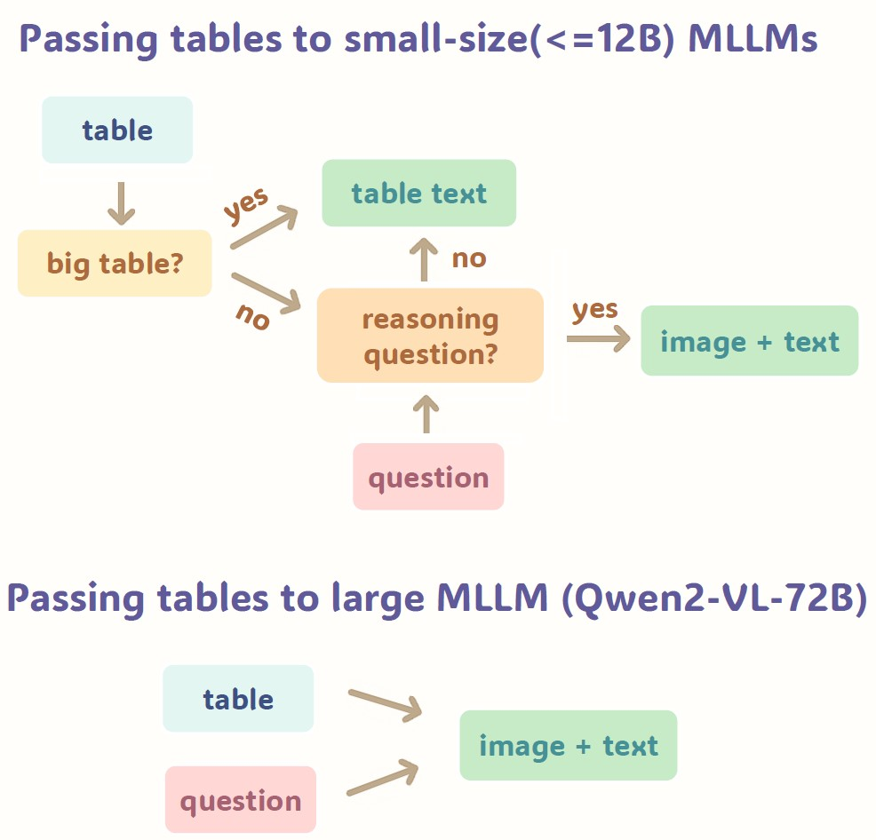

# [ACL 2025 Findings] [Texts or Images? A Fine-grained Analysis on the Effectiveness of Input Representations and Models for Table Question Answering](https://arxiv.org/abs/2505.14131)



### Environment

```sh
conda create --name fres python=3.10 -y
conda activate fres
pip install -r requirements.txt
```

### Data

Relevant fields for each data instance:

```
{"question": a question to be answered,
 "table": a table in list format containing lists of rows.
 "table_id": id of table, can be mapped to a corresponding table image.
 "answer": a list containing answer(s) to a question.
 "question_complexity": question type, either retrieve or reasoning.
 "size": either small or big.
}
```

Corresponding table images can be either obtained from [MMTAB](https://huggingface.co/datasets/SpursgoZmy/MMTab) (WTQ, TabFact, HiTab, TabMWP), converted from html provided by [TempTabQA](https://zenodo.org/records/10022927), or created using our provided scripts in `create_images.py` (CRT).

### Usages

- Generate outputs with MLLMs

  ```
  python inference.py --model_path  path_to_the_MLLM \
  --dataset_path path_to_the_dataset  \
  --model_name  name_of_the_model \
  --output_dir  output_directory of the results \
  --style  prompt_stype # (0,1,2) \
  --add_table_text  # if added, passing both table text and image to the MLLM
  --no_question  # if enabled, passing empty string instead of question (to exclude bad examples)
  --no_table # if enabled, passing empty table or blank image insteand of original table content (to exclude bad examples)
  ```

- Generate outputs with LLMs

  ```
  python inference_text.py --model_path  path_to_the_MLLM \
  --dataset_path path_to_the_dataset  \
  --model_name  name_of_the_model \
  --output_dir  output_directory of the results \
  --style  prompt_stype # (0,1,2) \
  --no_question  # if enabled, passing empty string instead of question (to exclude bad examples)
  --no_table # if enabled, passing empty table or blank image insteand of original table content (to exclude bad examples)
  ```

- Generate images based on table texts (CRT)

  ```
  python create_images.py
  --dataset_path path_to_the_dataset  \
  --output_dir  output_directory of returned images \
  ```
